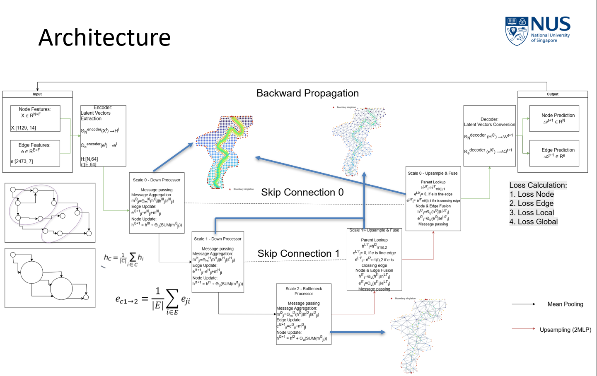

# MultiScale-DFGNN

## Overview

MultiScale-DFGNN is an extension of **DUALFloodGNN** that introduces hierarchical graph processing for flood forecasting.

The original DUALFloodGNN performs joint node-edge message passing on a single computational graph and combines data-driven predictions with physics-informed global and local mass-conservation losses.

MultiScale-DFGNN extends this framework by introducing multiple graph resolutions. The original HEC-RAS mesh is progressively coarsened into lower-resolution graphs, allowing the model to propagate information over larger spatial regions while maintaining predictions at the original fine resolution.

The model follows a **fine-to-coarse-to-fine** architecture consisting of:

- node and edge feature encoders;
- fine-scale node-edge message passing;
- deterministic connectivity-preserving graph coarsening;
- latent node and edge pooling;
- coarse-scale message passing;
- bottleneck processing;
- parent-graph-based upsampling;
- encoder-decoder skip connections;
- fine-scale message passing after fusion;
- node and edge output decoders.

The additional graph scales operate on **latent representations** rather than explicit hydraulic states. Final flood predictions and physics-informed losses remain evaluated on the original fine-resolution graph.

This repository is based on the original DUALFloodGNN implementation:

- **DUALFloodGNN:** https://github.com/acostacos/dual_flood_gnn
- **MultiScale-DFGNN:** https://github.com/leonardojrjs14/Multiscale-DFGNN

---

## Multiscale Architecture

<p align="center">
  
</p>

The architecture follows a **Fine → Coarse → Fine** processing strategy.

For the default configuration:

```yaml
num_scales: 3
```

the graph hierarchy becomes:

```text
Scale 0: Fine Graph
        ↓
Scale 1: Coarse Graph
        ↓
Scale 2: Bottleneck Graph
        ↓
Scale 1: Coarse Graph
        ↓
Scale 0: Fine Graph
```

Therefore, a three-scale model performs:

```text
2 downsampling operations
2 upsampling operations
```

The overall model flow is:

```text
Raw Node Features                    Raw Edge Features
       │                                    │
       ▼                                    ▼
  Node Encoder                         Edge Encoder
       │                                    │
       └────────── Latent Graph ────────────┘
                         │
                         ▼
                Fine NodeEdgeConv
                    (Scale 0)
                         │
                         ▼
                   Mean Pooling
                         │
                         ▼
               Coarse NodeEdgeConv
                    (Scale 1)
                         │
                         ▼
                   Mean Pooling
                         │
                         ▼
              Bottleneck NodeEdgeConv
                    (Scale 2)
                         │
                         ▼
               Learned Upsampling
                         +
                  Skip Connection
                         │
                         ▼
               Coarse NodeEdgeConv
                    (Scale 1)
                         │
                         ▼
               Learned Upsampling
                         +
                  Skip Connection
                         │
                         ▼
                Fine NodeEdgeConv
                    (Scale 0)
                         │
                 ┌───────┴───────┐
                 │               │
                 ▼               ▼
           Node Decoder      Edge Decoder
                 │               │
                 ▼               ▼
            Node Output      Edge Output
```

### Processing Steps

The forward propagation can be summarized as follows:

1. Raw node and edge features are encoded into latent representations.
2. Node-edge message passing is performed on the original fine graph.
3. Fine nodes are grouped into connected coarse clusters.
4. Node and crossing-edge latent representations are mean-pooled into the next graph scale.
5. Message passing is performed independently at each graph resolution.
6. The coarsest graph acts as the multiscale bottleneck.
7. Coarse latent representations are mapped back to their child graph using the parent mapping.
8. Learnable upsampling MLPs transform the transferred coarse representations.
9. Upsampled features are fused with saved encoder features using skip connections.
10. Message passing is performed again after each fusion stage.
11. The final fine-scale latent graph is passed through separate node and edge decoders.

---

## Model Configuration

The multiscale model is configured inside:

```text
configs/config.yaml
```

Example configuration:

```yaml
model_parameters:

  MultiScaleDUALFloodGNN:

    hidden_features: 64

    num_scales: 3
    coarsening_factor: 4
    layers_per_scale: 1

    activation: 'relu'
    residual: True

    mlp_layers: 3

    skip_connections: True

    encoder_layers: 3
    encoder_activation: 'relu'

    decoder_layers: 3
    decoder_activation: 'relu'
```

### Main Parameters

| Parameter | Description |
|---|---|
| `hidden_features` | Dimension of latent node and edge embeddings |
| `num_scales` | Number of graph resolutions |
| `coarsening_factor` | Approximate number of nodes grouped into each coarse cluster |
| `layers_per_scale` | Number of message-passing blocks applied at each graph scale |
| `mlp_layers` | Number of MLP layers inside the message-passing modules |
| `skip_connections` | Enables encoder-decoder feature fusion |
| `encoder_layers` | Number of layers used in node and edge encoders |
| `decoder_layers` | Number of layers used in node and edge decoders |

---

# Setup

## Environment

Clone the repository:

```bash
git clone https://github.com/leonardojrjs14/Multiscale-DFGNN.git
cd Multiscale-DFGNN
```

Create a Python virtual environment:

```bash
python -m venv venv
```

Activate it on Linux:

```bash
source venv/bin/activate
```

On Windows PowerShell:

```powershell
venv/Scripts/Activate.ps1
```

Check the active environment:

```bash
which python
python --version
```

The original DUALFloodGNN implementation was tested using Python 3.12.3.

---

## Install PyTorch

Install PyTorch according to the CUDA version available on your system.

For example, the original DUALFloodGNN environment used PyTorch 2.5.1:

```bash
pip install torch==2.5.1 torchvision==0.20.1 torchaudio==2.5.1 \
  --index-url https://download.pytorch.org/whl/cu${CUDA}
```

Replace `${CUDA}` with the corresponding CUDA build.

For example:

```text
CUDA 12.4 → 124
```

Verify PyTorch:

```bash
python -c "import torch; print(torch.__version__); print(torch.version.cuda); print(torch.cuda.is_available())"
```

---

## Install PyTorch Geometric

Install PyTorch Geometric:

```bash
pip install torch_geometric
```

Install additional PyG libraries if required:

```bash
pip install pyg_lib torch_scatter torch_sparse torch_cluster torch_spline_conv \
  -f https://data.pyg.org/whl/torch-2.5.1+cu${CUDA}.html
```

Verify:

```bash
python -c "import torch_geometric; print(torch_geometric.__version__)"
```

Install the remaining project dependencies:

```bash
pip install -r requirements.txt
```

---

# Dataset

The dataset follows the same structure as the original DUALFloodGNN implementation.

## HEC-RAS Simulation Files

Download the HEC-RAS simulation data from:

https://doi.org/10.25910/9xav-0s86

Required files include:

- HEC-RAS flood simulation files (`HDF_FILES.zip`);
- training event summary (`train.csv`);
- testing event summary (`test.csv`).

After extracting the HDF files, rename the directory to:

```text
HEC-RAS Results
```

> **Note:** The geometry files provided with the original dataset release should not be used. Updated geometry files are provided separately by the original DUALFloodGNN project.

---

## Geometry Files

The geometry directory should contain files such as:

```text
GEOMETRY/
├── cell_centers_with_ele.shp
├── links_with_slope.shp
├── DEM.tif
└── ...
```

---

## Dataset Structure

The dataset directory should have approximately the following structure:

```text
data/
└── datasets/
    ├── train.csv
    ├── test.csv
    │
    ├── GEOMETRY/
    │   ├── cell_centers_with_ele.shp
    │   ├── links_with_slope.shp
    │   ├── DEM.tif
    │   └── ...
    │
    └── HEC-RAS Results/
        ├── Model_01.p22.hdf
        ├── Model_01.p23.hdf
        └── ...
```

Set the dataset path inside:

```text
configs/config.yaml
```

Example:

```yaml
dataset_parameters:

  root_dir: '/path/to/data/datasets'

  nodes_shp_file: 'GEOMETRY/cell_centers_with_ele.shp'
  edges_shp_file: 'GEOMETRY/links_with_slope.shp'
  dem_file: 'GEOMETRY/DEM.tif'
```

---

## Dataset Features

| Feature Class | Type | Feature | Description | Source |
|---|---|---|---|---|
| Graph | Static | Edge index | Graph connectivity `[from_node, to_node]` | Geometry |
| Node | Static | Position | X and Y coordinates | Geometry |
| Node | Static | Area | Mesh-cell area | HEC-RAS |
| Node | Static | Roughness | Manning's roughness coefficient | HEC-RAS |
| Node | Static | Elevation | Ground elevation | Geometry |
| Node | Static | Aspect | Terrain orientation | DEM |
| Node | Static | Curvature | Terrain curvature | DEM |
| Node | Static | Flow accumulation | Upslope contributing area | DEM |
| Node | Dynamic | Rainfall | Rainfall at each timestep | HEC-RAS |
| Node | Dynamic | Water volume | Water volume in each mesh cell | HEC-RAS |
| Edge | Static | Relative position | Relative coordinates between connected cells | Geometry |
| Edge | Static | Face length | Length of the shared mesh face | HEC-RAS |
| Edge | Static | Length | Graph-link length | Geometry |
| Edge | Static | Slope | Link slope | Geometry |
| Edge | Dynamic | Face flow | Water flow across an edge | HEC-RAS |

---

# Running the Code

## Quick Start

Train MultiScaleDUALFloodGNN:

```bash
python train.py \
  --config configs/config.yaml \
  --model MultiScaleDUALFloodGNN
```

Using a GPU:

```bash
python train.py \
  --config configs/config.yaml \
  --model MultiScaleDUALFloodGNN \
  --device cuda
```

Using CPU:

```bash
python train.py \
  --config configs/config.yaml \
  --model MultiScaleDUALFloodGNN \
  --device cpu
```

---

## Debug Mode

Before launching a full training run, it is recommended to run the model in debug mode.

CPU:

```bash
python train.py \
  --config configs/config.yaml \
  --model MultiScaleDUALFloodGNN \
  --device cpu \
  --debug True \
  --with_test False
```

GPU:

```bash
python train.py \
  --config configs/config.yaml \
  --model MultiScaleDUALFloodGNN \
  --device cuda \
  --debug True \
  --with_test False
```

Debug mode can be used to verify:

- dataset loading;
- node and edge feature dimensions;
- graph hierarchy construction;
- graph sizes at each scale;
- fine-to-coarse mappings;
- forward propagation;
- loss computation;
- backward propagation;
- NaN or Inf values.

A recommended debugging sequence is:

```text
Dataset
   ↓
Graph Hierarchy
   ↓
Model Initialization
   ↓
Forward Pass
   ↓
Loss Calculation
   ↓
Backward Pass
   ↓
Full Training
```

---

# Testing

After training, inspect the available checkpoints:

```bash
ls saved_models/
```

Run testing:

```bash
python test.py \
  --config configs/config.yaml \
  --model MultiScaleDUALFloodGNN \
  --model_path saved_models/MultiScaleDUALFloodGNN_<timestamp>.pt \
  --device cuda
```

CPU testing:

```bash
python test.py \
  --config configs/config.yaml \
  --model MultiScaleDUALFloodGNN \
  --model_path saved_models/MultiScaleDUALFloodGNN_<timestamp>.pt \
  --device cpu
```

> **Important:** A trained model checkpoint is required before running `test.py`.

---

# Entry Points

| File | Description | Main Arguments |
|---|---|---|
| `train.py` | Train a selected GNN model | `--config`, `--model`, `--with_test`, `--seed`, `--device`, `--debug` |
| `test.py` | Perform inference using a trained model checkpoint | `--config`, `--model`, `--model_path`, `--seed`, `--device`, `--debug` |
| `hp_search.py` | Bayesian hyperparameter search | `--config`, `--hparam_config`, `--model`, `--seed`, `--device` |
| `eda.ipynb` | Dataset exploration and analysis | N/A |
| `view_results.ipynb` | Training and testing result visualization | N/A |

Shell scripts (`.sh`) are mainly used for running experiments on Slurm-based HPC systems.

---

# Code Structure

The repository is organized into the following main directories:

| Folder | Description |
|---|---|
| `configs/` | Dataset, model, loss, training, and testing configuration files |
| `constants/` | Shared project constants |
| `data/` | Dataset loading, preprocessing, normalization, and boundary-condition handling |
| `loss/` | Prediction and physics-informed loss functions |
| `models/` | GNN architectures including DUALFloodGNN and MultiScaleDUALFloodGNN |
| `training/` | Training and autoregressive curriculum logic |
| `testing/` | Testing and autoregressive rollout utilities |
| `utils/` | General utilities and multiscale hierarchy construction |
| `saved_models/` | Model checkpoints |
| `training_stats/` | Training statistics |
| `saved_metrics/` | Testing metrics |

Important multiscale components include:

```text
models/multiscale_dual_flood_gnn.py
utils/
configs/config.yaml
train.py
test.py
```

---

# Baseline DUALFloodGNN

The original single-scale DUALFloodGNN implementation is retained for baseline comparison.

Train the baseline model:

```bash
python train.py \
  --config configs/config.yaml \
  --model DUALFloodGNN \
  --device cuda
```

Test the baseline:

```bash
python test.py \
  --config configs/config.yaml \
  --model DUALFloodGNN \
  --model_path saved_models/DUALFloodGNN_<timestamp>.pt \
  --device cuda
```

This enables direct comparison between the original single-scale architecture and the multiscale extension using the same dataset and training framework.

---

# Acknowledgement

MultiScale-DFGNN is built upon the **DUALFloodGNN** framework developed by Carlo Malapad Acosta and collaborators.

Original repository:

https://github.com/acostacos/dual_flood_gnn

DUALFloodGNN paper:

https://arxiv.org/abs/2512.23964

---

# Citation

If you use this repository, please cite the original DUALFloodGNN work:

```bibtex
@misc{acosta2026,
    title={
        DUALFloodGNN: Physics-informed Graph Neural Network
        for Operational Flood Modeling
    },
    author={
        Carlo Malapad Acosta and
        Herath Mudiyanselage Viraj Vidura Herath and
        Jia Yu Lim and
        Abhishek Saha and
        Sanka Rasnayaka and
        Lucy Marshall
    },
    year={2026},
    eprint={2512.23964},
    archivePrefix={arXiv},
    primaryClass={cs.LG},
    url={https://arxiv.org/abs/2512.23964}
}
```
